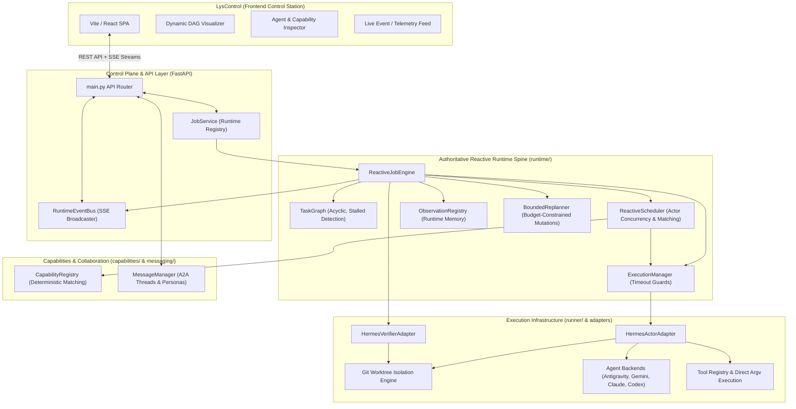

# LysStack / Hermes Lab Architecture & Phase Evolution

## 1. Executive Summary & System Overview

**LysStack** (orchestration backend / control plane in `Hermes-lab`) and **LysControl** (operator-facing React/Vite control station) provide an end-to-end, capability-aware, multi-agent orchestration runtime for software engineering workflows.

### Core Philosophy

Traditional workflow orchestrators model jobs as static, predefined Directed Acyclic Graphs (DAGs) or rigid sequential phase loops. LysStack models execution as a **reactive runtime spine**:

```text
User Goal / Sprint Spec
         ↓
    Job Record
         ↓
      PLANNING
         ↓
  Initial Task Graph
         ↓
Event-Driven Scheduler ←←←←←←←←←←←←←←←←←←←←←←←←←←←←←←←←←←←←←←←←
         ↓                                                    ↑
Agent / Tool Execution                                        ↑
         ↓                                                    ↑ (FIRST_COMPLETED)
Observation & Artifact Discovery                              ↑
         ↓                                                    ↑
     VERIFYING                                                ↑
         ↓                                                    ↑
Verification Outcome ──[PASSED]──────→ COMPLETED              ↑
         │                                                    ↑
   [REPAIRABLE / REPLAN]                                      ↑
         ↓                                                    ↑
Bounded Dynamic Replanner ──[Mutations: Add/Supersede Task]───┘
         │
  [Budget Exhausted / Fatal] ────────→ BLOCKED
```

### Separation of Concerns

1. **WHAT to do next (Authoritative Reactive Runtime)**: Owned by [`ReactiveJobEngine`](file:///home/lystiger/projects/hermes-lab/runtime/engine.py), [`TaskGraph`](file:///home/lystiger/projects/hermes-lab/runtime/task_graph.py), [`ReactiveScheduler`](file:///home/lystiger/projects/hermes-lab/runtime/scheduler.py), and [`BoundedReplanner`](file:///home/lystiger/projects/hermes-lab/runtime/replanning.py). Evaluates preconditions, schedules tasks dynamically, observes outcomes, and mutates the graph incrementally.
2. **HOW to execute safely (Execution Infrastructure)**: Owned by [`HermesActorAdapter`](file:///home/lystiger/projects/hermes-lab/runtime/hermes_adapter.py), [`HermesVerifierAdapter`](file:///home/lystiger/projects/hermes-lab/runtime/hermes_adapter.py), [`ExecutionManager`](file:///home/lystiger/projects/hermes-lab/runtime/execution.py), and low-level agent runners ([`HermesSprintRunner`](file:///home/lystiger/projects/hermes-lab/runner/runner.py)). Manages CLI processes, git worktrees, tool registries, file mutation, timeout guards, and test execution.

---

## 2. High-Level Architecture Topology



---

## 3. Core Subsystems

### 3.1. Reactive Runtime Spine (`runtime/`)

#### 1. `ReactiveJobEngine` ([`runtime/engine.py`](file:///home/lystiger/projects/hermes-lab/runtime/engine.py))
The authoritative orchestrator for an individual job lifecycle. It drives the state machine:
- `CREATED` $\to$ `PLANNING` $\to$ `EXECUTING` $\to$ `VERIFYING` $\to$ `COMPLETED`
- `VERIFYING` $\to$ `REPAIRING` $\to$ `EXECUTING` (on repairable check failures)
- `EXECUTING` / `REPAIRING` $\to$ `BLOCKED` (on unrecoverable failures, deadlocks, or exhausted replan budgets)
- Any $\to$ `CANCELLED` (on operator abort)

Uses an async `FIRST_COMPLETED` wait loop so fast-completing concurrent tasks immediately unlock dependents while slow parallel tasks continue executing.

#### 2. `TaskGraph` & `TaskNode` ([`runtime/task_graph.py`](file:///home/lystiger/projects/hermes-lab/runtime/task_graph.py))
Dynamic DAG representing units of work:
- **Duplicate Prevention**: Rejects duplicate task IDs with `ValueError`.
- **Cycle Detection**: Prevents cyclical dependencies via reachability checks on insertion.
- **Safe Removal & Superseding**: Rejects removal of tasks that have active dependents; provides `supersede_task()` to replace obsolete tasks cleanly.
- **Stalled & Deadlock Detection**: Provides `is_stalled()`, `has_runnable_tasks()`, and `find_dependency_blocked_tasks()` to trigger immediate replanning or blocked transitions when tasks cannot proceed.

#### 3. `ReactiveScheduler` ([`runtime/scheduler.py`](file:///home/lystiger/projects/hermes-lab/runtime/scheduler.py))
Selects and matches available actors for runnable tasks:
- **Capability-Aware Selection**: Matches `TaskNode.required_capabilities` against actor capabilities.
- **Actor Concurrency Tracking**: Tracks `_busy_actors` per actor ID with configurable per-actor concurrency limits.
- **Explainable Decisions**: Distinguishes `ACTOR_BUSY` (which defers the task as `READY`) from `NO_CAPABLE_ACTOR` (which marks the task `BLOCKED`).

#### 4. `ExecutionManager` & `AgentRun` ([`runtime/execution.py`](file:///home/lystiger/projects/hermes-lab/runtime/execution.py))
Tracks discrete execution attempts:
- Manages runs with timestamps, exit reasons, and artifact references.
- Wraps execution in timeout guards, marking runs as `TIMED_OUT` without crashing the scheduler.

#### 5. `ObservationRegistry` & `Observation` ([`runtime/observations.py`](file:///home/lystiger/projects/hermes-lab/runtime/observations.py))
Dynamic runtime memory capturing outputs, errors, test results, discovered files, and metrics. Used by planners and verifiers for informed context.

#### 6. `BoundedReplanner` ([`runtime/replanning.py`](file:///home/lystiger/projects/hermes-lab/runtime/replanning.py))
Enforces hard bounds on dynamic adaptation:
- Restricts mutations (`ADD_TASK`, `SUPERSEDE_TASK`, `ADD_DEPENDENCY`, `REMOVE_DEPENDENCY`, `UPDATE_TASK_METADATA`).
- Strictly enforces `max_replans_per_job`, `max_tasks_per_job`, and `max_task_attempts`.

#### 7. `VerifierAdapter` & `VerificationResult` ([`runtime/verification.py`](file:///home/lystiger/projects/hermes-lab/runtime/verification.py))
Executes structured verification steps and returns `PASSED`, `REPAIRABLE`, or `FAILED` with actionable repair recommendations.

---

### 3.2. Capabilities Subsystem (`capabilities/`)

- **Capability Descriptors**: Open-string descriptors (e.g., `implementation`, `code.python`, `review.code`, `verification`, `backend.fastapi`, `frontend.react`).
- **Capability Registry**: [`CapabilityRegistry`](file:///home/lystiger/projects/hermes-lab/capabilities/capabilities.py#L86) provides registration of actors, query mechanisms, deterministic scoring, and tie-breaking.
- **Normalization & Proficiency**: Canonical normalization rules and optional proficiency weightings.

---

### 3.3. Collaboration & Messaging (`messaging/` & `events/`)

- **Agent-to-Agent Messaging**: [`MessageManager`](file:///home/lystiger/projects/hermes-lab/messaging/messaging_manager.py) manages multi-turn peer conversations, persona context, and thread hierarchies.
- **Runtime Event Bus**: High-performance [`RuntimeEventBus`](file:///home/lystiger/projects/hermes-lab/events/event_bus.py) powers Server-Sent Events (SSE) streaming live telemetry to `LysControl`.

---

### 3.4. Execution Infrastructure (`runner/` & `runtime/hermes_adapter.py`)

- **`HermesActorAdapter`**: Bridges `TaskNode` execution to CLI tools, agent subprocesses, or sessionful Herdr workers.
- **`HermesVerifierAdapter`**: Executes project test suites (Playwright, pytest, npm, uv) with isolated working directories and timeouts.
- **Worktree Isolation**: Git worktrees created per sprint/task under dedicated storage roots, isolating changes before integration merges.

---

## 4. Phase-by-Phase Evolution

```text
Phase 1-2: Scaffolding & Git Worktrees
   ├── FastAPI control service & health endpoints
   └── Worktree isolation engine per agent sprint

Phase 3-4: Agent Adapters & Execution Backends
   ├── Pluggable CLI agent adapters (Antigravity, Claude, Codex)
   └── Subprocess and Herdr agent execution backends

Phase 5: Three-Agent Delivery & Generic Verification
   ├── Three-agent pipeline (Scaffolding → Hardening → Verification)
   ├── Generic multi-command verification pipeline (Playwright / npm / uv / pytest)
   ├── Sessionful Herdr lifecycle & ownership verification
   └── Control REST API & cross-process job runners

Phase 6 & 6.1: Agent-to-Agent (A2A) Messaging & Persona Threads
   ├── Structured A2A peer communication protocol
   ├── Multi-turn conversation threads & persona contexts
   └── Live SSE event bus integration

Phase 7: Capability-Aware Delegation & Tool Actors
   ├── Open-string capability registry & deterministic matching
   ├── Dynamic task delegation & tool actor assignments
   └── Operator control UI (LysControl) capability views

Phase 8: Reactive Runtime Spine
   ├── Dynamic incremental TaskGraph
   ├── Event-driven ReactiveScheduler & ExecutionManager
   ├── ObservationRegistry & BoundedReplanner
   └── Structured Verification & Repair loop

Phase 8.1: Runtime Integration & Invariant Hardening
   ├── ReactiveJobEngine established as authoritative production path
   ├── HermesActorAdapter & HermesVerifierAdapter infrastructure bridges
   ├── TaskGraph invariant hardening (duplicate rejection, cycle detection, safe removal)
   ├── Stalled graph / deadlock detection with immediate BLOCKED transition
   ├── Concurrency tracking (ACTOR_BUSY vs NO_CAPABLE_ACTOR)
   ├── Execution timeouts with TIMED_OUT run states
   └── FIRST_COMPLETED event reactivity unlocking ready dependent tasks

Phase 8.1.3: Async Execution & Fail-Closed Runtime
   ├── Blocking agent/Git work dispatched off the event loop (asyncio.to_thread)
   ├── Per-repository Git mutation lock serializing commits and integration merges
   ├── Fail-closed worktree creation, validation, and integration fetch/reset
   ├── context.root resolved once at launcher/spec-normalization time
   ├── No permissive default ToolPolicy; runtime-stamped tool requester identity
   └── Bounded OBSERVATION_DISCOVERY graph expansion

Phase 8.1.4: Follow-Up Triggering & Cancellation Safety (Phase 8 freeze)
   ├── Observations flagged requires_follow_up drive discovery replanning automatically
   ├── Opportunistic replans that add nothing no longer BLOCK a healthy job
   └── Cancellation stops in-flight workers, marks the graph, and releases actors

Phase 9: Durable Event-Sourced Runtime Sessions
   ├── Canonical append-only event store backed by PostgreSQL / asyncpg / SQLAlchemy
   ├── In-memory event store interface for fast isolated unit testing
   ├── Per-job monotonic sequence ordering (1, 2, 3...) via transaction advisory locks
   ├── Idempotent event deduplication and fail-closed persistence error semantics
   ├── Deterministic RuntimeStateProjector reconstructing JobRecord, TaskGraph, Runs, Observations
   ├── Alembic migrations (001_initial_runtime_events.py) and local Docker Compose PostgreSQL
   └── Seamless API recovery enabling historical inspection without live in-memory engines

Phase 9.1: Durable Commit Semantics & Reconstruction Completeness
   ├── Asynchronous store append strictly precedes external publication and execution advancement
   ├── Fail-closed persistence failure handling: never swallow errors, halt immediately, cancel workers
   ├── Gap-free monotonic sequence verification: explicit sequence gaps rejected with SequenceConflictError
   ├── Canonical task.cancelled and agent.cancelled events with full execution metadata
   ├── Reconstructed state cleanup guaranteeing no RUNNING/READY task or run leftovers on cancelled jobs
   ├── Advisory lock acquisition precedes event_id check; fails closed on lock error under PostgreSQL
   ├── Multi-store concurrent sequence allocation and race-safe duplicate event_id deduplication
   └── Deterministic artifact deduplication across created events, task completions, and agent runs

Phase 9.1.1: Production Cancellation & Terminal Atomicity
   ├── JobLauncher.cancel() / cancel_async() safely routes through await engine.cancel() across loops
   ├── Live POST /jobs/{id}/cancel tested with full post-cancellation event projection
   ├── Deduplication of task.cancelled events at the bridge level (single emission per task ID)
   ├── Unified list_unfinished_jobs() cross-dialect consistency checking event types and state payloads
   ├── Live PostgreSQL two-store concurrency and idempotency testing against Docker service
   └── Guaranteed job.created persistence before POST /jobs acknowledges creation (launch_async)
```

---

## 5. Runtime Invariants & Safety Guarantees

1. **Authoritative DAG Authority**: The static phase array is demoted to input configuration; `ReactiveJobEngine` is the sole runtime orchestrator.
2. **Acyclic Graphs**: Every `add_dependency` call validates reachability, strictly forbidding cycles.
3. **Immutable Identity**: `TaskGraph.add_task` strictly rejects duplicate task IDs with `ValueError`.
4. **Safe Task Removal**: A task cannot be removed if other active tasks depend on it; it must be superseded instead.
5. **Deterministic Deadlock Detection**: Stalled dependency states trigger bounded replans or transition to `BLOCKED` immediately without waiting for `max_steps`.
6. **Replan Budget Enforcement**: Dynamic graph mutations cannot exceed `max_replans_per_job`, `max_tasks_per_job`, or `max_task_attempts`.
7. **Terminal State Guards**: Once a job transitions to a terminal state (`BLOCKED`, `COMPLETED`, `CANCELLED`), subsequent steps cannot illegally transition back to active states.
8. **Concurrency & Busy Safety**: An actor currently executing a task defers additional tasks as `READY` rather than falsely blocking them.
9. **Timeout Containment**: Task execution exceeding configured limits generates a structured failure and `TIMED_OUT` run record without crashing the runtime.
10. **Non-Blocking Execution**: Agent CLI processes, tool subprocesses, and Git commands run on worker threads; a blocking agent never stalls the engine's event loop.
11. **Serialized Git Mutation**: All worktree creation, commit, sync, and integration-merge operations against one repository are held under a single process-wide reentrant lock; concurrent tasks execute their agents in parallel but mutate Git one at a time.
12. **Fail-Closed Infrastructure**: A worktree that cannot be created or validated, or an integration fetch/reset that fails, fails the task with a `worktree_error` exit reason. The runtime never degrades to an unversioned directory or a stale base, and only a directory that is the top level of its own worktree is treated as one.
13. **Fail-Closed Tool Policy**: There is no permissive default `ToolPolicy`. When neither the task nor the spec declares one, `allowed_tools` is unset and the registry rejects the invocation.
14. **Runtime-Stamped Requester Identity**: Every tool invocation carries a requester assigned by the runtime. Identity on agent-emitted embedded requests is overwritten, so an agent cannot claim a privileged identity to bypass capability gating.
15. **Bounded Discovery Expansion**: Observation-driven replanning expands the graph only for observations explicitly flagged `requires_follow_up`, capped per replan, gated on remaining replan budget, and idempotent through observation-derived task IDs.
16. **Single Point of Path Resolution**: `context.root` is resolved and validated at launcher/spec-normalization time relative to the sprint specification directory; the adapter rejects an unresolved relative root rather than re-resolving it against a different base.
17. **Self-Triggering Discovery**: An observation flagged `requires_follow_up` drives a discovery replan on its own, at most once per observation. Adapters do not need to also set `trigger_replan`.
18. **Opportunistic vs. Blocking Replans**: A discovery replan that produces no mutations means no extra work is needed and leaves the job EXECUTING. Failure- and deadlock-driven replans keep the original semantics: a planner with nothing to offer transitions the job to `BLOCKED`.
19. **Cancellation Containment**: Cancelling a job — by operator, by driver-task cancellation, or on any exit from `run_until_complete` — stops every in-flight execution task, marks unfinished graph tasks `CANCELLED`, emits canonical cancellation events, and releases actor slots.
20. **Durable Canonical Ledger**: Process-memory state is transient; the append-only event store is the authoritative, immutable source of truth for runtime history.
21. **Strict Monotonic Sequencing**: Events for each job receive consecutive integer sequences (1, 2, 3...) allocated atomically under transaction locks, guaranteeing exact total ordering per job with no gaps.
22. **Idempotent Deduplication**: Appending an event with an existing `event_id` and identical payload succeeds idempotently; conflicting payloads fail fast with `IdempotencyConflictError`.
23. **Fail-Closed Persistence**: State transitions must persist to durable storage before execution advances. Storage unavailability halts or fails the job rather than quietly continuing in a non-reconstructable state.
24. **Deterministic Reconstruction**: `RuntimeStateProjector` reconstructs identical `JobRecord`, `TaskGraph`, `AgentRun`, `Observation`, and artifact structures from the event stream without requiring live engine process memory.
25. **No Silent Storage Fallback**: A configured PostgreSQL database that is unreachable at startup fails fast with `StorageUnavailableError` rather than silently degrading to transient in-memory storage.

---

## 6. Testing & Quality Assurance

The system is validated across comprehensive test suites:

- **Total Backend Pytest Tests**: **289 tests** (287 passed, 2 skipped, 0 failed).
- **Hardening Suite (`tests/test_phase8_1_runtime_hardening.py`)**: 14 tests verifying production launch, deadlocks, cycles, concurrency, timeouts, and reactivity.
- **Async & Fail-Closed Suite (`tests/test_phase8_1_3_async_failclosed.py`)**: 20 tests verifying off-loop concurrent agent execution, serialized Git mutation, worktree and sync fail-closure, context resolution, tool policy and requester identity, and bounded discovery expansion.
- **Follow-Up & Cancellation Suite (`tests/test_phase8_1_4_followup_cancellation.py`)**: 10 tests verifying automatic discovery triggering, opportunistic vs. blocking replan semantics, and cancellation containment across operator, driver-cancellation, and normal-exit paths.
- **Phase 9.1 & Durability Hardening Suite (`tests/test_phase9_1_durability.py`)**: 9 tests verifying synchronous persist precedence, fail-closed task and job completion errors, unswallowed exceptions in run loops, valid ledger prefixes, gap rejection, in-memory state rollback on persistence failure, synchronous/async cancel coordination, and pre-seeded production task persistence.
- **Phase 9.1 Cancellation & Reconstruction Suite (`tests/test_phase9_1_cancellation_reconstruction.py`)**: 4 tests verifying `task.cancelled` and `agent.cancelled` persistence, state projection with no RUNNING leftovers, and artifact set equivalence.
- **Phase 9.1.1 Cancellation & Terminal Atomicity Suite (`tests/test_phase9_1_1_cancel_and_reconstruct.py`)**: 2 tests verifying `POST /jobs` durable persistence and `/jobs/{id}/cancel` event projection without duplicate `task.cancelled`.
- **Event Store Suite (`tests/test_phase9_event_store.py`)**: 7 tests verifying ordered history, per-job sequences, concurrent appends, idempotency, envelope validation, immutability, and unfinished job queries.
- **Reconstruction Suite (`tests/test_phase9_reconstruction.py`)**: 5 tests verifying pure deterministic projection of JobRecord, TaskGraph, AgentRuns, Observations, Artifacts, and Replan/Repair counters.
- **Postgres Concurrency & Multi-Store Suite (`tests/test_phase9_postgres_concurrency.py`, `tests/test_phase9_postgres_integration.py`)**: 8 tests verifying async database storage, advisory lock concurrency, multi-store concurrent sequences, multi-store idempotency, live Docker PostgreSQL verification, and fail-closed lock errors.
- **API & Durability Suite (`tests/test_phase9_api_and_durability.py`)**: 3 tests verifying historical API reconstruction without engines, startup fail-fast behavior, and backward compatibility.
- **Acceptance Scenario Suite (`tests/test_phase9_acceptance_scenario.py`)**: End-to-end multi-agent reactive workflow with discovery, replan, verification failure, repair, artifact tracking, and complete post-destruction event reconstruction.
- **Frontend Vitest Suite (`LysControl`)**: 41 tests across 10 test suites covering UI views, adapters, delegation, and messaging.
- **Cross-Process Integration**: Validates end-to-end FastAPI subprocess execution and live event synchronization.
